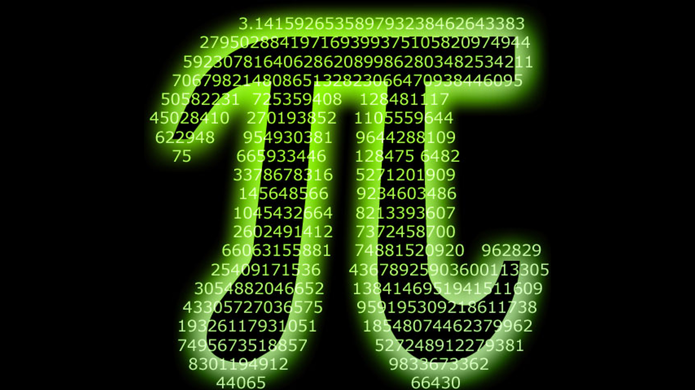
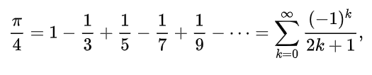
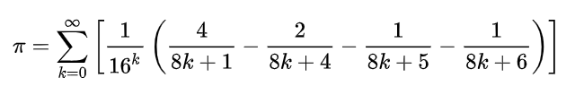

# Advanced Multithreading: Detailed report for pi(π) number calculation with Multi-Threaded program

[//]: # (![]&#40;assets/pi.webp?raw=ture&#41;)
[//]: # (![]&#40;assets/pi.png&#41;)

Pi number is known as ratio of a circle's circumference to its diameter which today has been calculated up to 105 trillion digits.
 Here we're attempting to find pi number with a multi-threaded program and discuss around pros and cons of each approach.
  At last, I'll give brief explanation of how semaphore in java works (:

## Finding an algorithm for pi calculation
### **First Approach: Leibniz formula**
The Leibniz formula is indeed a compelling solution for approximating π due to its simplicity and straightforward mathematical operations.

[//]: # (![]&#40;assets/simplicity.png&#41;)

 
As expected it driven from the Taylor series for the inverse tangent function for the value of 1 (arctan(1) = π/4)

### The Reality Check: Dead end
After implementation, I noticed it was a nice practice unless you're expecting 1000 floating points🤦‍♂️
 Number of digits outputted after 20 sec = ~20. Tho, it's fine to put your pc days and nights on to achieve the desired   result 🌚

### **Here we go: Bailey–Borwein–Plouffe formula (BBP)**
For the final program, I’ve employed the Bailey–Borwein–Plouffe (BBP) formula, a remarkable method for calculating π. Closer look to formula:

## Implementation Details
- **Big Decimal Objects:** All numerical values are stored as big decimal objects to maintain precision.
- **Multithreading:** I’ve set up a thread pool with 5 threads. Each thread is tasked with computing 100 terms of the BBP series.
  Thread pool is used to reduce the complexity of thread management and increase performance by reducing the number of context switches.
- **Total Computation:** Collectively, the threads compute 2000 terms of the series, harnessing the power of parallel processing to expedite the calculation.

## Semaphore

is used to control access to a shared resource by multiple threads and avoid critical section problems (Thread interruption, race condition). 
In this project the access to the `Resource` class is limited to 2 at a time.

## References
- **Pi Calculation**
  - [**Wikipedia** - Leibniz formula for π](https://en.wikipedia.org/wiki/Leibniz_formula_for_%CF%80) 
  - [**Wikipedia** - Bailey–Borwein–Plouffe formula](https://en.wikipedia.org/wiki/Bailey%E2%80%93Borwein%E2%80%93Plouffe_formula)
  - [**Ioflood** - Java BigDecimal Class](https://ioflood.com/blog/java-bigdecimal/#:~:text=BigDecimal%20is%20used%20in%20Java,and%20division%20with%20high%20precision.&text=In%20this%20example%2C%20we%20create,bd%20using%20the%20add%20method.)
- **Semaphore**
  - [**Wikipedia** - Semaphore](https://en.wikipedia.org/wiki/Semaphore_(programming))
  - [**GeeksforGeeks** - Semaphore in Java](https://www.geeksforgeeks.org/semaphore-in-java/)
